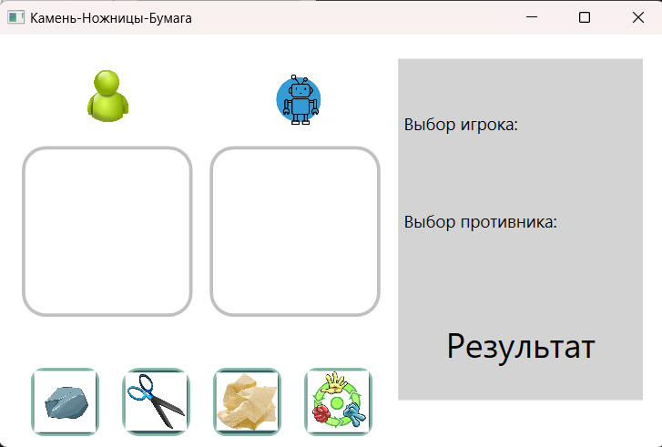
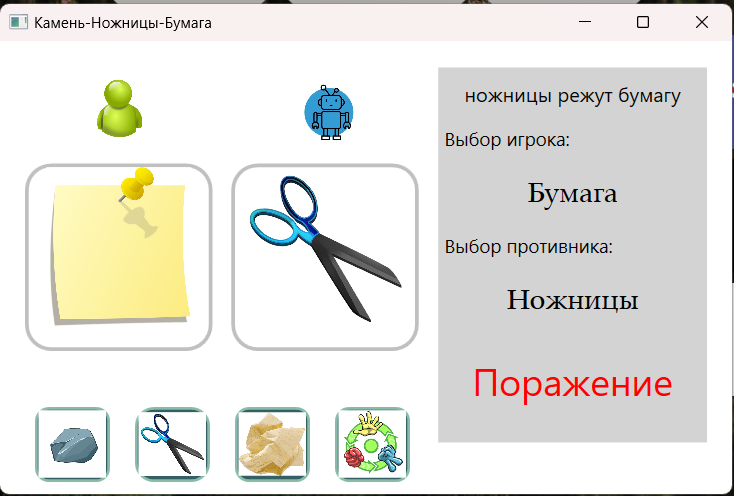
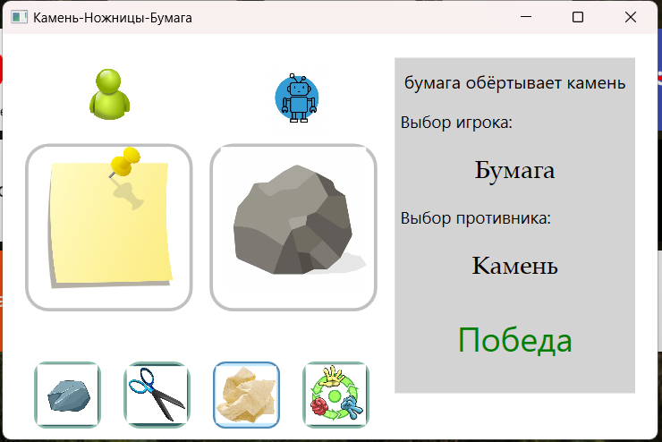

# tsu-e-fa
Игра «Камень, ножницы, бумага».
Описание.
«ЦУ-Е-ФА!» — классическая игра, развивающая внимательность, память, логику и смекалку. 
Игра: игрок/компьютер. Управление: мышью.
В игре можно делать выбор самостоятельно или воспользоваться случайным выбором.

Скриншоты.

